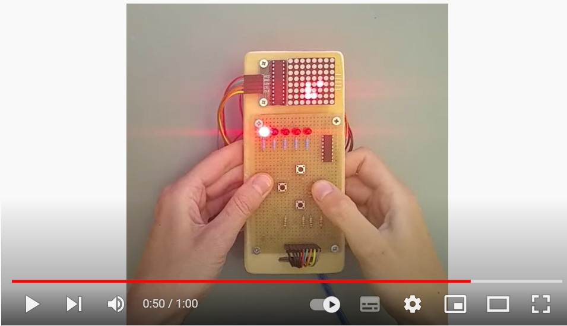

# Snake
The classic game "Snake".

Hardware: 
- Arduino nano
- 8x8 LED display
- 5 LEDs + shift register (for level display)

Check out this 1-minute video of the development process and gameplay:

